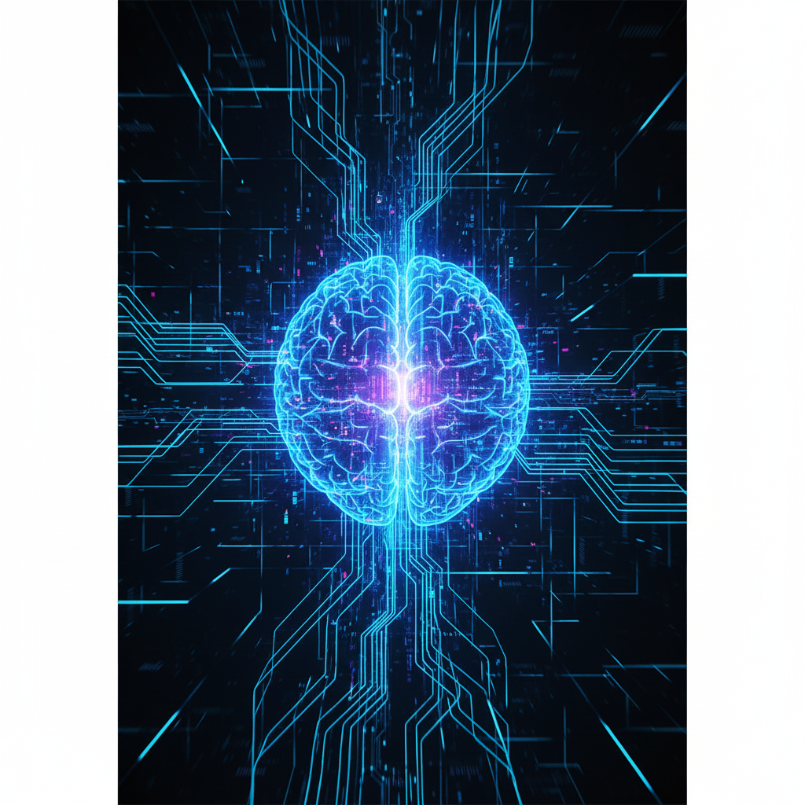

# 📘 Codificando o Futuro: A Revolução da IA no Desenvolvimento

> *Um mergulho prático em como a Inteligência Artificial Generativa está redefinindo o papel do programador moderno.*

---

## 📖 Introdução
Bem-vindo a uma nova era. A programação, como a conhecemos, está evoluindo. Não estamos mais apenas escrevendo linhas de código; estamos orquestrando inteligências. Este e-book explora como ferramentas de IA Generativa não estão aqui para substituir desenvolvedores, mas para nos dar "superpoderes".

---

## 🧠 Capítulo 1: O Fim do Bloqueio Criativo

Todo desenvolvedor conhece o medo da tela em branco (ou da IDE vazia). Com a IA Generativa, o "start" inicial se tornou instantâneo. 

Seja gerando um *boilerplate* para uma API REST ou sugerindo estruturas de banco de dados, a IA atua como um **par programador incansável**, disponível 24/7. A barreira de entrada diminuiu, mas a necessidade de pensamento crítico aumentou.

---

## 🛠️ Capítulo 2: Mais que Código, Soluções

A verdadeira magia não está em pedir para a IA "escrever uma função", mas em pedir para ela "explicar o erro". 

A capacidade de depuração e refatoração assistida por IA transformou horas de *troubleshooting* em minutos de aprendizado. Ferramentas modernas permitem que foquemos na arquitetura e na lógica de negócios, deixando a sintaxe repetitiva para a máquina.

---

## ⚠️ Capítulo 3: O Desafio "Fake Natty"

Com grande poder vem grande responsabilidade. O termo **"Fake Natty"** nos lembra que nem tudo que parece humano e perfeito é real. 

Códigos gerados por IA podem conter alucinações, falhas de segurança ou vieses ocultos. O papel do desenvolvedor mudou de "escritor" para "auditor". Saber validar se o código é seguro e eficiente é a nova habilidade essencial do século XXI.

---

## 🚀 Conclusão

A IA Generativa não é o fim da programação; é o seu renascimento. Aqueles que abraçarem essas ferramentas liderarão a inovação. O futuro não é humano *versus* máquina, é humano *mais* máquina. 

**E você, está pronto para codificar o futuro?**

---
*Gerado por Gemini para o desafio DIO Lab: Natty or Not*
